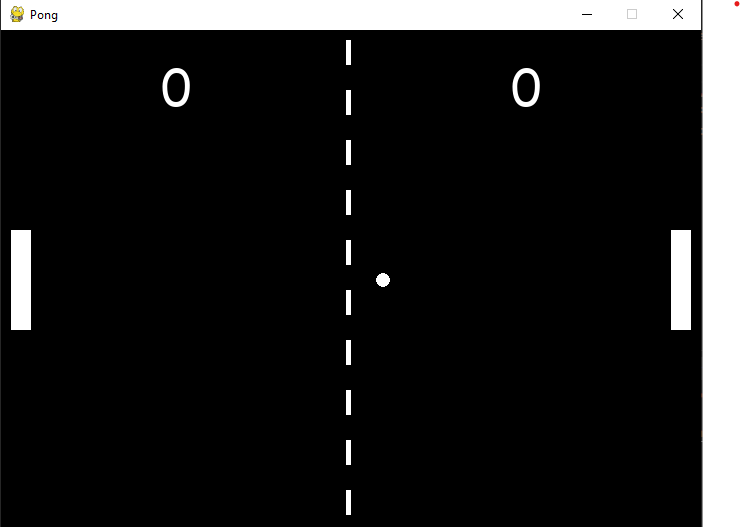

# Pong

2 Player pong game! Built with python and pygame.

<p align='center'>
	
</p>

# Requirements

Use the package manager [pip](https://pip.pypa.io/en/stable/) to install following packages :-
* Pygame

```bash
pip install pygame
```
# Controls
### P1:
* Use **W** key to move up and **S** key to move down.
### P2:
* Use **Up** arrow key to move up and **Down** arrow key to move down.
